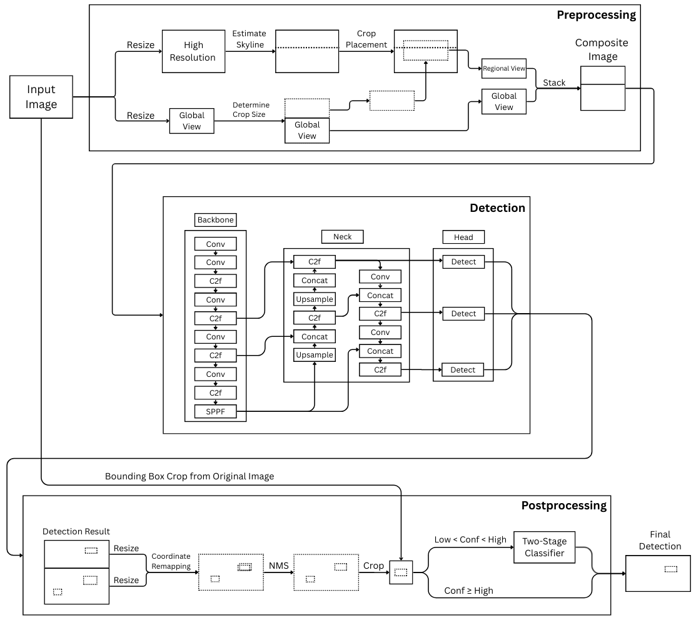

# Wildfire Smoke Detection Pipeline

[](<https://github.com/Jung0219/Wildfire-Detection>) &nbsp;
[](<YOUR_PAPER_URL>) &nbsp;
[](<YOUR_ARXIV_URL>) &nbsp;

[Introduction](#introduction)
| [Overview](#overview)
| [How to use](#how-to-use)
| [Citation](#citation)
| [Acknowledgements](#acknowledgements)

## Introduction

This repository provides the official implementation of “Early Wildfire Smoke Detection with a Multi-Resolution Framework and Two-Stage Classification Pipeline.” We introduce a skyline-guided composite multi-resolution detection strategy that enhances sensitivity to faint, small early-stage smoke regions while preserving single-pass real-time inference. By dynamically stacking a global view with a high-resolution sky-aligned band and refining low-confidence predictions through a lightweight second-stage classifier, our framework improves detection robustness near deployment thresholds without retraining the base detector. For detailed information, please refer to the paper.

<p align="center">
  
</p>

## How to use

### Environment

We tested our code on Ubuntu 24.04.3 LTS with an NVIDIA RTX A5000 (24GB) GPU. While the framework was validated under this configuration, it should run on other systems with compatible CUDA and PyTorch versions; Windows users are recommended to use WSL or Docker for environment consistency.

#### Add dependencies to your python environment

We tested the environment with Python 3.10 and CUDA 12.6, and we recommend using Conda to manage dependencies for reproducibility. To install the mandatory dependencies after setting up your Conda environment, run the command below.

``` shell
conda env create -f environment.yml
conda activate <env-name>
```

### Training

```bash
python src/train/train_detector.py
python src/train/train_classifier.py
```

### Batch inference

Use and edit:

- `src/pipeline/run/batch/batch_run.yaml`

Then run:

```bash
python src/pipeline/run/batch/run.py
```

### Evaluation

Use:

- `src/evaluation/eval_metrics.py`
- `src/evaluation/coco_eval.py`

Datasets and pretrained weights are not included in this repository.

## Citation

```bibtex
@article{your_paper_2025,
  title   = {<Paper Title>},
  author  = {<Author List>},
  journal = {<Venue or arXiv>},
  year    = {2025}
}
```

## Acknowledgements

This repository includes research code used for paper experiments, with some components built on top of open-source detection/classification tooling.
